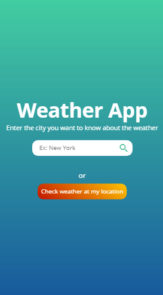
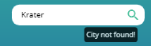
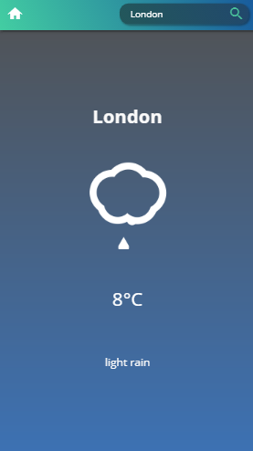
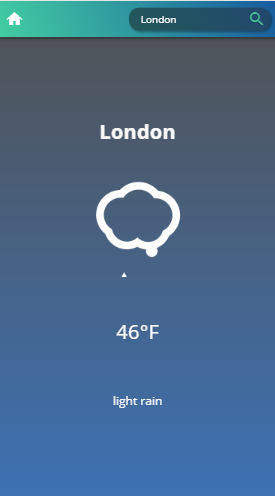

# About Weather App

The app was built with the purpose to put in practice my skills developed in pure JavaScript. It is an application that will **show you in real time the weather conditions from anywhere in the world**, with information supplied by the [Open Weather Map API](https://openweathermap.org/api).

## Install

On terminal:

1. Run `git clone https://github.com/rpbarone/weather-app.git`
2. Run `cd weather-app`
3. Open `index.html`

Or you can access it through the [direct link](https://rpbarone.github.io/weather-app/) where the app is hosted on Github Pages.

## How to use

### When entering the application, you will have two options to choose from:

* Search by city name
  * If there is no information about the city searched, you will receive something like this:
  
  
  
  `So, make sure you are typing the corret name of the city and searching that name in English.`

* Get information about your current location
  * For this option, you must allow access to your location.

### When searching for a city name, you will get the following information:

  
  
As you see, you can get:
* Temperature degree
* A funny icon animated [Skycon](https://darkskyapp.github.io/skycons/) showing different states of weather, as too or parcially cloud, sunny or if we only have a beautiful moon in the sky! 

  * And more: **The background changes its color according to the climatic conditions.** Try it in different locations of the world to see.

### Are you not used to temperature in Celsius? No problem!

To convert the temperature to Fahrenheit, **just click on the temperature** and the magic will happen:

  

## Built with
* HTML
* CSS
* Javascript
* Restful API

## Authors
* Raphael Barone - [rpbarone](https://github.com/rpbarone/)
